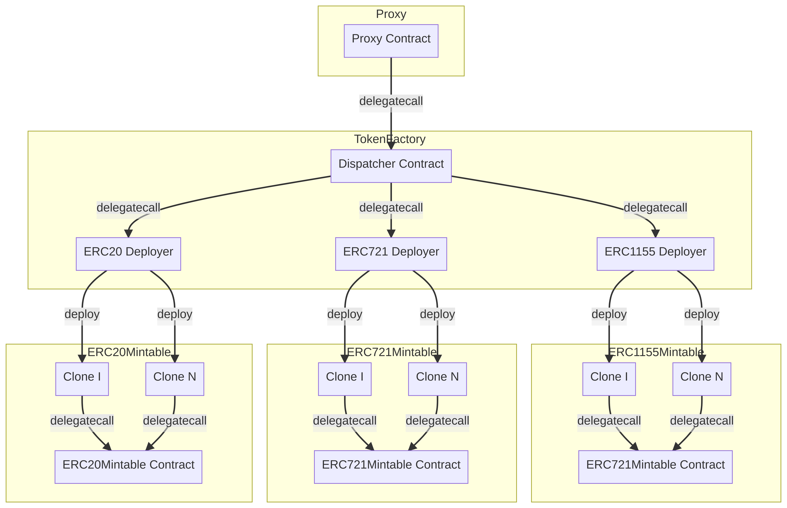

# StarkExpress Contracts - Mintable Module
This module implements a factory for mintable tokens to be deployed by the StarkExpress platform.

## Blueprint
The following blueprint highlights the structure of the module:
```php
mintable
├── core      # Core contracts and interfaces.
├── erc20     # Mintable ERC-20 token contracts.
├── erc721    # Mintable ERC-721 token contracts.
├── erc1155   # Mintable ERC-1155 token contracts.
├── factory   # Factory contracts for deploying mintable tokens.
├── proxy     # Minimal ERC-2535 proxy implementation.
└── utils     # General helper functions.
```

## Architecture
The system architecture is composed by four main components that work together to provide a cheap, flexible and upgradeable system for creating and minting new tokens on the Ethereum blockchain. The following diagram presents the overall achitecture:


### Proxy Contract
The `Proxy` contract is used to enable large structural upgrades or modifications to the deployed factory system without disrupting the existing token contract addresses. The `Proxy` contract delegates all, but upgradability-related calls, to the `TokenFactory` contract, which then delegates the calls to the appropriate token deployer contract. The contract implements the [ERC-1967](https://eips.ethereum.org/EIPS/eip-1967) standard for simple integration with block explorers (ie. Etherscan).

### TokenFactory Contract
The `TokenFactory` contract implements dispatch logic similar to the suggested [ERC-2535](https://eips.ethereum.org/EIPS/eip-2535) (Diamond) pattern. It introduces improvements from the reference implementation to simplify the code and adhere to standard naming conventions.

The contract manages a lookup table that maps function selector token deployer contract. Using a dispatcher allows us to avoid Ethereum's maximum contract size limits (24kB), by splitting the deployment logic among several deployer contracts invoked with delegate calls. Additionaly, it gives us flexibility when adding, removing or updating deployable tokes from the factory.

### Deployer Contracts
The deployer contracts implement the token deployment logic for StarkExpress mintable tokens. They are executed in the context of the `Proxy` contract (both address and storage), using delegate calls. A deployer contract is responsible for deploying a single token type and registering it in the StarkEx system.

All deployers rely on clones ([ERC-1167](https://eips.ethereum.org/EIPS/eip-1167)) to deploy minimal proxy contracts that delegate all calls to a single token implementation. This allows for a decrease in deployment costs of about 10 times due to the small bytecode size of the proxies. Note that ERC-1667 proxies [are supported](https://medium.com/etherscan-blog/eip-1167-minimal-proxy-contract-on-etherscan-3eaedd85ef50) by the most popular block explorers.

Additionaly, the deployer contracts rely on the [CREATE2](https://docs.openzeppelin.com/cli/2.8/deploying-with-create2) opcode to deploy contracts to pre-computed deterministic addresses.

### Token Contracts
The token contracts implement tokens that can be minted in the StarkExpress L2 platform and later bridged back to Ethereum. In order to being withdrawn to Ethereum all tokens must implement the `IMintable` interface, which contains methods to mint the token in the L1.

Additionaly, due to the deployment strategy, based on minimal proxy clones, used by the deployer contracts all tokens support the [initializable pattern](https://soliditydeveloper.com/design-pattern-solidity-initialize-contract-after-deployment) instead of the more common constructor based initialization.

As of today we provide deployer implementations for the following tokens:

| Token | Description |
| --- | --- |
| [MintableERC20](https://threesigmaxyz.github.io/starkexpress-mintable-contracts/src/erc20/ERC20Mintable.sol/contract.ERC20Mintable.html) | A mintable fungible token according to the [ERC20](https://ethereum.org/en/developers/docs/standards/tokens/erc-20/) standard. |
| [MintableERC721](https://threesigmaxyz.github.io/starkexpress-mintable-contracts/src/erc721/ERC721Mintable.sol/contract.ERC721Mintable.html) | A mintable non-fungible token according to the [ERC721](https://ethereum.org/en/developers/docs/standards/tokens/erc-721/) standard. | 
| [MintableERC1155](https://threesigmaxyz.github.io/starkexpress-mintable-contracts/src/erc1155/ERC1155Mintable.sol/contract.ERC1155Mintable.html) | A mintable multi-token according to the [ERC1155](https://ethereum.org/en/developers/docs/standards/tokens/erc-1155/) standard. |

## About Us
[Three Sigma](https://threesigma.xyz/) is a venture builder firm focused on blockchain engineering, research, and investment. Our mission is to advance the adoption of blockchain technology and contribute towards the healthy development of the Web3 space.

If you are interested in joining our team, please contact us [here](mailto:info@threesigma.xyz).

---

<p align="center">
  
</p>